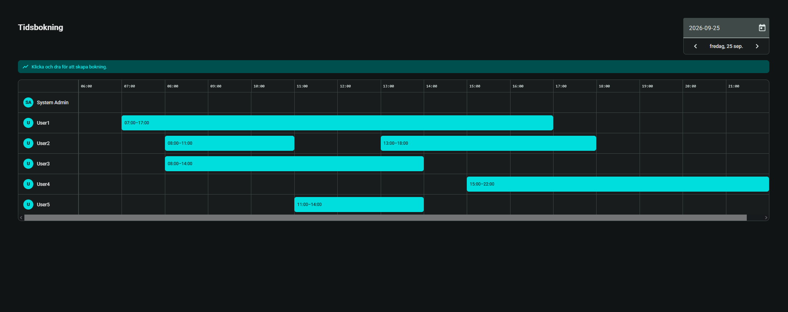

# Changelog

All notable changes to this project are documented here.
Format based on [Keep a Changelog](https://keepachangelog.com/en/1.1.0/).

## [Unreleased]

### Planned

- Flyway database migrations (replacing Hibernate `ddl-auto=update`)
- Teams / groups
- Shifts
- Automated tests and CI
- Sequin integration

## [0.1.1] - 2026-09-25

- **Scheduler:** Schedule view showing one row per user.

  

- **Localization:** Swedish (`sv-SE`) locale registered app-wide, with Angular Material's calendar/datepicker used for date selection in the scheduler

## [0.1.0] - 2026-09-21

### Added

- **Infrastructure:** Docker Compose setup running PostgreSQL 16, Adminer, the API and the client with live reload
- **Backend:** Java 25 / Spring Boot 4.1 API, organised package-by-feature
- **Auth:** stateless JWT authentication with public `/auth/register` and `/auth/login` endpoints, Spring Security filter chain and CORS configuration. Authguard in Frontend to prevent access without valid authentication.
- **Users:** user domain (entity, repository, service, controller) with separate input/output DTOs so entities never leak into the JSON
- **Assignments:** assignment domain following the same structure as users
- **Frontend:** Angular 22 standalone-component app using signals, with a sidebar and a users page
- **Typed API client:** generated from the OpenAPI spec with `ng-openapi`, including auth and date-handling interceptors
